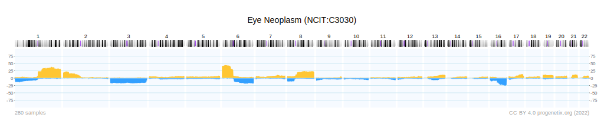

### What is CNV/CNA?
Copy number  aberration (CNA) / Copy number variation (CNV) is a phenomenon in which the number of copies of a specific segment of DNA varies between individuals. In the majority of cancer types are CNAs present and have a functional impact in cancer  development.

### How will you describe or introduce progenetix (scale, data source, cancer types and so on)?
Progenetix is a cancer genome data resource which provides an overview of mutation data in cancer, with a focus on CNV/CNA.
The data is based on individual sample data from more than 140000 samples.
The genomic profiling data was derived from genomic arrays and chromosomal Comparative Genomic Hybridization (CGH) as well as Whole Genome or Whole Exome Sequencing (WGS, WES) studies. Genomic profiles are either processed from various raw data formats or are extracted from published experimental results.

### Describe NCIt, ICD-O, UBERON codes, and their relationships.
The International Classification of Diseases for Oncology (ICD-O) is structured as a combination of morphology and topography.
In contrast, the thesaurus of the National Cancer Institute (NCIt)  has a hirachical structure.
UBERON is a cross-species anatomical structural ontology system with a relationship structure.

### How does progenetix visualise CNA profiles? What are CNV segmentations and CNV frequencies, and how to use them? What are APIs and how to use APIs in progenetix?
The graph shows, in this case for an Eye Neoplasm, how frequent CNAs occurr on the respective segment of the gemone.

API: application programming interface
